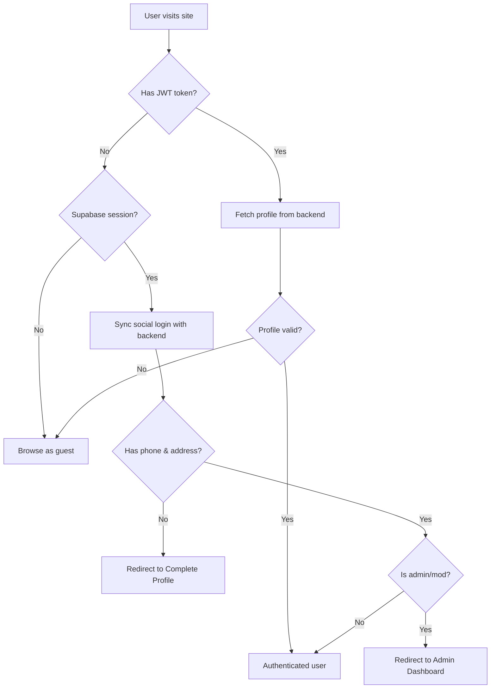

<p align="center">
  
  
  
  
  
</p>

<h1 align="center">🛍️ Eraya — Frontend</h1>

<p align="center">
  <strong>A premium, modern ecommerce storefront built with React 19, featuring real-time chat, AI shopping assistant, and a full-featured admin dashboard.</strong>
</p>

<p align="center">
  <a href="https://eraya-phi.vercel.app">🌐 Live Demo</a> •
  <a href="https://eraya-backend.onrender.com/docs">📖 API Documentation</a>
</p>

---

## ✨ Features at a Glance

### 🛒 Customer Experience

- **Product Catalog** — Search, filter by category, sort by price/popularity/latest, price range filtering
- **Product Details** — Image gallery, color & size selection, variation-based stock tracking, reviews
- **Shopping Cart** — Add/remove items with color/size variants, quantity management
- **Wishlist** — Save products for later, synced to account
- **Checkout** — Cash on Delivery + bKash mobile payment integration
- **Order Tracking** — Full lifecycle visibility (Pending → Confirmed → Shipped → Delivered)
- **User Profiles** — Avatar upload, phone/address management, order history
- **AI Shopping Assistant** — Intelligent chatbot that recommends real products from the catalog
- **Live Chat** — Real-time WebSocket messaging with admin support
- **Social Login** — Google & GitHub OAuth via Supabase Auth

### 🔧 Admin Dashboard

- **Dashboard Analytics** — Revenue charts, order statistics, category sales breakdown, low stock alerts
- **Product Management** — CRUD with multi-image upload, bulk delete, variation stock management
- **Category Management** — Create/edit categories with images, bulk operations
- **Order Management** — Real-time order notifications (WebSocket), status updates, OTP-protected deletion
- **User Management** — View/search users, role assignment (buyer/moderator/admin), bulk role updates
- **Review Moderation** — Approve/reject reviews, view all ratings
- **Live Chat Console** — Real-time admin ↔ buyer conversations with typing indicators
- **Coupon Management** — Create percentage/flat coupons with expiry and minimum cart value
- **Store Settings** — Configure delivery fees, tax, store info, logo upload

---

## 🏗️ Project Structure

```
Frontend/
├── index.html               # Entry HTML with Manrope & Inter fonts
├── vite.config.js            # Vite + React + Tailwind CSS v4 plugin
├── vercel.json               # SPA rewrite rules for Vercel deployment
├── package.json              # Dependencies & scripts
└── src/
    ├── main.jsx              # React DOM root mount
    ├── App.jsx               # Router config, auth sync, route guards
    ├── App.css               # Global custom styles & animations
    ├── index.css              # Tailwind CSS v4 base + custom utilities
    ├── supabase.js            # Supabase client initialization
    │
    ├── api/
    │   └── axios.js           # Axios instance with JWT interceptor & asset URL helper
    │
    ├── store/                 # Zustand state management
    │   ├── useAuthStore.js    # Authentication state, login/signup/social auth
    │   ├── useCartStore.js    # Cart operations & local storage sync
    │   ├── useChatStore.js    # WebSocket chat state & message management
    │   ├── useSettingsStore.js# Store settings (delivery, tax, branding)
    │   └── useWishlistStore.js# Wishlist sync with backend
    │
    ├── hooks/                 # Custom React hooks
    │   ├── useClickOutside.js # Click outside detection for dropdowns/modals
    │   ├── useDebounce.js     # Input debouncing for search
    │   └── useDocumentTitle.js# Dynamic page titles
    │
    ├── components/            # Reusable UI components
    │   ├── Navbar.jsx         # Main navigation with search, cart badge, user menu
    │   ├── Footer.jsx         # Site footer with links & branding
    │   ├── ProductCard.jsx    # Product card with wishlist toggle & quick add
    │   ├── AIChatBot.jsx      # AI shopping assistant floating widget
    │   ├── ChatWidget.jsx     # Live customer support chat widget
    │   ├── Chat/              # Chat sub-components
    │   ├── Pagination.jsx     # Reusable pagination component
    │   ├── Skeleton.jsx       # Loading skeleton components
    │   ├── Logo.jsx           # Brand logo component
    │   ├── AdminGuard.jsx     # Route guard for admin/moderator roles
    │   ├── GuestGuard.jsx     # Route guard for unauthenticated users
    │   ├── LoginModal.jsx     # Login prompt modal for guests
    │   ├── OTPInput.jsx       # OTP digit input component
    │   ├── OTPModal.jsx       # OTP verification modal
    │   ├── ConfirmModal.jsx   # Generic confirmation dialog
    │   ├── DeleteConfirmModal.jsx # Delete confirmation with OTP support
    │   ├── ActionConfirmationModal.jsx # Action confirmation overlay
    │   ├── AdminDropdown.jsx  # Admin panel dropdown menus
    │   ├── ErrorMsg.jsx       # Error message display
    │   ├── ScrollToTop.jsx    # Scroll restoration on navigation
    │   └── TakaIcon.jsx       # Bangladeshi Taka (৳) currency icon
    │
    ├── layouts/               # Page layout wrappers
    │   ├── MainLayout.jsx     # Customer-facing layout (Navbar + Footer + Chat)
    │   └── AdminLayout.jsx    # Admin panel layout (Sidebar + Header + Content)
    │
    ├── pages/                 # Route pages
    │   ├── Home.jsx           # Landing page with hero, categories, featured products
    │   ├── Products.jsx       # Product listing with search & filters
    │   ├── ProductDetails.jsx # Full product page with reviews & variations
    │   ├── Cart.jsx           # Shopping cart with coupon application
    │   ├── Checkout.jsx       # Multi-step checkout (address, payment)
    │   ├── Wishlist.jsx       # User's saved products
    │   ├── Profile.jsx        # User profile & order history
    │   ├── EditProfile.jsx    # Profile editing with avatar upload
    │   ├── CompleteProfile.jsx # Post-social-login profile completion
    │   ├── OrderTracking.jsx  # Order status timeline
    │   ├── Login.jsx          # Login page with social OAuth
    │   ├── Signup.jsx         # Registration with OTP verification
    │   ├── Sustainability.jsx # Brand sustainability page
    │   ├── BkashMock.jsx      # bKash sandbox payment simulator
    │   │
    │   │── AdminDashboard.jsx # Analytics dashboard with charts
    │   ├── AdminProducts.jsx  # Product CRUD with variation editor
    │   ├── AdminCategories.jsx# Category management
    │   ├── AdminOrders.jsx    # Order management with real-time updates
    │   ├── AdminUsers.jsx     # User management & roles
    │   ├── AdminReviews.jsx   # Review moderation
    │   ├── AdminChat.jsx      # Admin chat console
    │   ├── AdminCoupons.jsx   # Coupon management
    │   ├── AdminSettings.jsx  # Store configuration
    │   └── AdminProfile.jsx   # Admin profile settings
    │
    └── assets/                # Static assets (images, icons)
```

---

## ⚡ Tech Stack

| Category             | Technology                                                                              |
| -------------------- | --------------------------------------------------------------------------------------- |
| **Framework**        | [React 19](https://react.dev/) — latest with concurrent features                       |
| **Build Tool**       | [Vite 8](https://vite.dev/) — lightning-fast HMR & optimized builds                    |
| **Styling**          | [Tailwind CSS v4](https://tailwindcss.com/) — utility-first, Vite plugin integration   |
| **State Management** | [Zustand 5](https://zustand.docs.pmnd.rs/) — lightweight, hook-based stores            |
| **Data Fetching**    | [TanStack React Query 5](https://tanstack.com/query) — caching, pagination, mutations  |
| **HTTP Client**      | [Axios](https://axios-http.com/) — request/response interceptors, JWT auto-attach      |
| **Routing**          | [React Router v7](https://reactrouter.com/) — nested routes, route guards              |
| **Animations**       | [Framer Motion 12](https://www.framer.com/motion/) — page transitions, micro-animations|
| **Charts**           | [Recharts 3](https://recharts.org/) — composable chart components                      |
| **Icons**            | [Lucide React](https://lucide.dev/) — modern, consistent icon set                      |
| **Toast Notifications** | [React Hot Toast](https://react-hot-toast.com/) — minimal, customizable             |
| **Auth Provider**    | [Supabase Auth](https://supabase.com/auth) — Google & GitHub OAuth                     |
| **Date Handling**    | [date-fns](https://date-fns.org/) — lightweight date formatting                        |
| **Typography**       | Google Fonts — Manrope (headings) + Inter (body)                                        |
| **Deployment**       | [Vercel](https://vercel.com/) — SPA with catch-all rewrite                             |

---

## 🎨 Design System

### Typography
- **Headings**: Manrope (400–800 weight) — geometric, modern
- **Body**: Inter (400–700 weight) — optimized for readability

### Color Palette
The design uses a sophisticated dark-on-light theme:
- **Primary**: Slate-900 (`#0f172a`) — deep navy for headers & CTAs
- **Background**: White to Slate-50 — clean, airy feel
- **Accents**: Context-dependent warm tones for actions

### Key UI Patterns
- **Skeleton Loading** — Custom shimmer states for products, cards, and tables
- **Responsive Design** — Mobile-first, breakpoints at sm/md/lg/xl
- **Glassmorphism** — Subtle backdrop-blur effects on overlays and modals
- **Micro-animations** — Framer Motion for page transitions, hover states, and reveals

---

## 🔐 Authentication Flow



### Supported Auth Methods
| Method          | Provider    | Description                                    |
| --------------- | ----------- | ---------------------------------------------- |
| Email/Password  | Backend JWT | Traditional signup with OTP email verification |
| Google OAuth    | Supabase    | One-click Google sign-in                       |
| GitHub OAuth    | Supabase    | Developer-friendly GitHub sign-in              |

---

## 🤖 AI Shopping Assistant

A floating chatbot widget available on all customer pages:

- **Context-Aware**: Queries the live product catalog to make real recommendations
- **Bilingual**: Understands both English and Bangla queries
- **Product Cards**: Recommended products render as clickable cards with images, prices, and direct links
- **Chat History**: Persisted for logged-in users across sessions
- **Dual AI Backend**: Gemini 2.0 Flash (primary) with Groq Llama 3.3 70B (automatic fallback)

---

## 💬 Real-Time Chat System

### Customer Side
- **ChatWidget**: Floating chat bubble on all pages
- **WebSocket-powered**: Instant message delivery
- **File sharing**: Send images in conversations
- **Message replies**: Thread context via reply-to
- **Read receipts**: Visual read/unread indicators
- **Unread badge**: Live unread count on chat icon

### Admin Side
- **Full chat console**: Multi-conversation management
- **User search**: Start conversations with any user
- **Typing indicators**: Real-time typing state detection
- **Conversation management**: Delete conversations and bulk message deletion

---

## 📱 Pages Overview

### Customer Pages

| Page                | Route                   | Description                                      |
| ------------------- | ----------------------- | ------------------------------------------------ |
| **Home**            | `/`                     | Hero banner, category grid, featured products    |
| **Products**        | `/products`             | Full catalog with search, filter, sort, paginate |
| **Product Details** | `/products/:slug`       | Image gallery, variants, reviews, add to cart    |
| **Cart**            | `/cart`                 | Cart summary, coupon input, checkout link        |
| **Checkout**        | `/checkout`             | Address form, payment selection (COD/bKash)      |
| **Wishlist**        | `/wishlist`             | Saved products grid                              |
| **Profile**         | `/profile`              | User info, order history with filtering          |
| **Edit Profile**    | `/profile/edit`         | Edit name, phone, address, avatar                |
| **Order Tracking**  | `/orders/:id`           | Step-by-step order status timeline               |
| **Login**           | `/login`                | Email/password + Google/GitHub OAuth             |
| **Signup**          | `/signup`               | Registration with OTP verification               |
| **Sustainability**  | `/sustainability`       | Brand values & sustainability info               |

### Admin Pages

| Page                | Route                   | Description                                      |
| ------------------- | ----------------------- | ------------------------------------------------ |
| **Dashboard**       | `/admin`                | Revenue charts, stats, recent activity           |
| **Products**        | `/admin/products`       | CRUD, bulk ops, image upload, variations         |
| **Categories**      | `/admin/categories`     | Category CRUD with images                        |
| **Orders**          | `/admin/orders`         | Real-time updates, status management             |
| **Users**           | `/admin/users`          | User list, role management, search               |
| **Reviews**         | `/admin/reviews`        | Moderation queue, approve/reject                 |
| **Chat**            | `/admin/chat`           | Customer support conversations                   |
| **Coupons**         | `/admin/coupons`        | Create & manage discount codes                   |
| **Settings**        | `/admin/settings`       | Store config, fees, branding                     |
| **Profile**         | `/admin/profile`        | Admin account settings                           |

---

## 🧩 State Management

| Store               | Purpose                                              |
| ------------------- | ---------------------------------------------------- |
| `useAuthStore`      | User auth state, JWT management, login/signup/social  |
| `useCartStore`      | Cart items, add/remove/update, localStorage fallback |
| `useChatStore`      | WebSocket connection, messages, conversations, typing |
| `useSettingsStore`  | Global store settings (delivery fees, tax, branding) |
| `useWishlistStore`  | Wishlist items, sync with backend for logged-in users |

---

## 🚀 Getting Started

### Prerequisites

- Node.js 20+
- npm 10+

### Setup

```bash
# Clone the repository
git clone <repo-url>
cd Frontend

# Install dependencies
npm install

# Copy environment template
cp .env.example .env
```

### Environment Variables

```env
# API Connection
VITE_API_BASE_URL=http://localhost:8080/api/v1
VITE_WS_URL=ws://localhost:8080/api/v1

# Supabase (for Auth & Asset URLs)
VITE_SUPABASE_URL=https://your-project.supabase.co
VITE_SUPABASE_ANON_KEY=your-anon-key
VITE_ASSETS_URL=https://your-project.supabase.co/storage/v1/object/public/eraya
```

### Development

```bash
# Start dev server with HMR
npm run dev

# Lint code
npm run lint

# Build for production
npm run build

# Preview production build
npm run preview
```

### Deployment (Vercel)

The project includes a `vercel.json` with SPA catch-all rewrite:

```json
{
  "rewrites": [
    { "source": "/(.*)", "destination": "/index.html" }
  ]
}
```

Deploy with:
```bash
npx vercel --prod
```

---

## ⚡ Build Optimization

The Vite config includes intelligent code splitting:

- **Vendor chunking**: Each `node_modules` package is split into its own chunk
- **Chunk size warning**: Set to 1000 KB to accommodate rich UI libraries
- **Tree shaking**: Automatic dead code elimination
- **CSS purging**: Tailwind CSS v4 purges unused utilities

---

## 🌐 Live URLs

| Environment | Frontend                          | Backend API                                 |
| ----------- | --------------------------------- | ------------------------------------------- |
| Production  | https://eraya-phi.vercel.app      | https://eraya-backend.onrender.com/api/v1   |
| Local       | http://localhost:5173             | http://localhost:8080/api/v1                |

